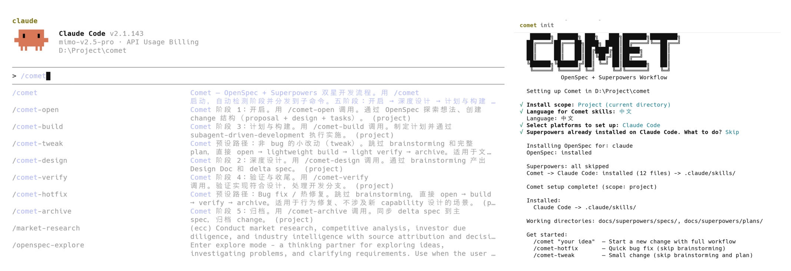

<p align="center">
  <a href="https://github.com/rpamis/comet">
    <picture>
      <source srcset="img/title-log.png">
      
    </picture>
  </a>
</p>

<p align="center">
  <a href="https://github.com/rpamis/comet/actions/workflows/ci.yml"></a>
  <a href="https://www.npmjs.com/package/@rpamis/comet"></a>
  <a href="https://www.npmjs.com/package/@rpamis/comet"></a>
  <a href="./LICENSE"></a>
</p>

# @rpamis/comet

```
 ██████╗ ██████╗ ███╗   ███╗███████╗████████╗
██╔════╝██╔═══██╗████╗ ████║██╔════╝╚══██╔══╝
██║     ██║   ██║██╔████╔██║█████╗     ██║
██║     ██║   ██║██║╚██╔╝██║██╔══╝     ██║
╚██████╗╚██████╔╝██║ ╚═╝ ██║███████╗   ██║
 ╚═════╝ ╚═════╝ ╚═╝     ╚═╝╚══════╝   ╚═╝
```

> 中文版：[README-zh.md](README-zh.md)

**OpenSpec + Superpowers dual-star development workflow** — one command from idea to archive.

OpenSpec handles **WHAT** (outlines, proposals, spec lifecycle, archiving). Superpowers handles **HOW** (technical design, planning, execution, wrap-up). Comet chains both into a five-phase automated pipeline.

## Why Comet

OpenSpec excels at managing requirements, creating proposals, managing Spec lifecycles, and archiving, but its proposals and tasks lack the detail of Superpowers brainstorming.

Superpowers generates Spec documents after brainstorming, but these documents typically lack stateful design — after completing requirements, Specs only have tasks checked off in the document, and Agents even forget to check them off. This causes the Agent to re-examine documents and project code to verify on resumption, wasting many tokens.

**Comet combines the strengths of both**, integrating the core workflow into 5 phases

The main entry `/comet` supports current Spec state detection, suitable for long tasks — after completing and closing CC midway, just `/comet continue` and Comet will automatically read the active Spec (lists multiple for selection), dynamically identify which phase is currently executing, and continue.

## Install

```bash
npm install -g @rpamis/comet
```

## Quick Start

```bash
cd your-project
comet init
```

`comet init` will:

1. Prompt you to select AI platforms (auto-detects existing configs)
2. Choose install scope: project-level (current directory) or global (home directory)
3. Select language for Comet skills: English or 中文
4. Install [OpenSpec](https://github.com/Fission-AI/OpenSpec) skills
5. Install [Superpowers](https://github.com/obra/superpowers) skills
6. Deploy Comet skills (in your chosen language) to selected platforms
7. Create `docs/superpowers/specs/` and `docs/superpowers/plans/` working directories

> [!TIP]
> update version
>
> comet update or `npm install -g @rpamis/comet@latest` to get the latest features and fixes.

## Screenshots

<p align="center">
  
</p>

<p align="center">Auto-install OpenSpec & Superpowers, one-click dev environment setup</p>
<p align="center">Multi-phase Skill entry, auto-detects current Spec stage, auto-triggers core flow, manual review at key nodes</p>

## Commands

| Command | Description |
|---------|-------------|
| `comet init [path]` | Initialize Comet workflow |
| `comet status [path]` | Show active changes and workflow status |
| `comet doctor [path]` | Diagnose Comet installation health |
| `comet update [path]` | Update comet skills to latest version |
| `comet --help` | Show help |
| `comet --version` | Show version |

### init Options

| Option | Description |
|--------|-------------|
| `--yes` | Non-interactive mode, auto-select detected platforms |
| `--skip-existing` | Skip already installed components |
| `--overwrite` | Overwrite already installed components |
| `--json` | Output structured JSON |

### status / doctor / update Options

| Option | Applies to | Description |
|--------|-----------|-------------|
| `--json` | `status`, `doctor` | Output structured JSON |
| `--language <lang>` | `update` | Language for skills (`en`, `zh`) |
| `--scope <scope>` | `update` | Install scope (`global`, `project`)|

## Supported Platforms

`comet init` supports 28 AI coding platforms:

| Platform | Skills Dir | Platform | Skills Dir |
|----------|-----------|----------|-----------|
| Claude Code | `.claude/` | Cursor | `.cursor/` |
| Codex | `.codex/` | OpenCode | `.opencode/` |
| Windsurf | `.windsurf/` | Cline | `.cline/` |
| RooCode | `.roo/` | Continue | `.continue/` |
| GitHub Copilot | `.github/` | Gemini CLI | `.gemini/` |
| Amazon Q Developer | `.amazonq/` | Qwen Code | `.qwen/` |
| Kilo Code | `.kilocode/` | Auggie | `.augment/` |
| Kiro | `.kiro/` | Lingma | `.lingma/` |
| Junie | `.junie/` | CodeBuddy | `.codebuddy/` |
| CoStrict | `.cospec/` | Crush | `.crush/` |
| Factory Droid | `.factory/` | iFlow | `.iflow/` |
| Pi | `.pi/` | Qoder | `.qoder/` |
| Antigravity | `.agent/` | Bob Shell | `.bob/` |
| ForgeCode | `.forge/` | Trae | `.trae/` |

## Skills

After `comet init`, three groups of skills are installed to the selected platform's `skills/` directory:

### Comet Skills

| Skill | Description |
|-------|-------------|
| `/comet` | Main entry — auto-detects phase and dispatches to sub-commands |
| `/comet-open` | Phase 1: Open a change (proposal, design, task breakdown) |
| `/comet-design` | Phase 2: Deep design (brainstorming, Design Doc) |
| `/comet-build` | Phase 3: Plan and build (implementation plan, code commits) |
| `/comet-verify` | Phase 4: Verify and finish (testing, verification report) |
| `/comet-archive` | Phase 5: Archive (delta spec sync, status annotation) |
| `/comet-hotfix` | Preset: Quick bug fix (skips brainstorming) |
| `/comet-tweak` | Preset: Small change (skips brainstorming and full plan) |

### Guard & Automation Scripts

| Script | Purpose |
|--------|---------|
| `comet-guard.sh` | Phase transition guard — validates exit conditions, `--apply` auto-updates `.comet.yaml` |
| `comet-archive.sh` | One-command archive — validates state, syncs specs, moves to archive, updates status |
| `comet-yaml-validate.sh` | Schema validator — validates `.comet.yaml` structure and field values |
| `comet-state.sh` | Unified state management — init/set/get/check/scale, agents' exclusive YAML interface |

### OpenSpec Skills

Spec lifecycle management: propose, explore, sync, verify, archive, and more.

### Superpowers Skills

Development methodology: brainstorming, TDD, subagent-driven development, code review, plan writing, and more.

## Workflow

```
/comet
  ↓ auto-detect
/comet-open  -->  /comet-design  -->  /comet-build  -->  /comet-verify  -->  /comet-archive
(OpenSpec)         (Superpowers)       (Superpowers)       (Both)           (OpenSpec)

/comet-hotfix (preset path, skips brainstorming)
  open  -->  build  -->  verify  -->  archive

/comet-tweak (preset path, skips brainstorming and full plan)
  open  -->  lightweight build  -->  light verify  -->  archive
```

### Five Phases

| Phase | Command | Owner | Artifacts |
|-------|---------|-------|-----------|
| 1. Open | `/comet-open` | OpenSpec | proposal.md, design.md, tasks.md |
| 2. Deep Design | `/comet-design` | Superpowers | Design Doc, delta spec |
| 3. Plan & Build | `/comet-build` | Superpowers | Implementation plan, code commits |
| 4. Verify & Finish | `/comet-verify` | Both | Verification report, branch handling |
| 5. Archive | `/comet-archive` | OpenSpec | delta→main spec sync, archive |

### Core Principles

- **Brainstorming is non-skippable** — every change must go through deep design (except hotfix/tweak)
- **Delta specs are living documents** — freely editable during Phase 3, synced at archive
- **Keep tasks.md in sync** — check off each task as completed
- **Commit frequently** — one commit per task, message reflects design intent
- **Verify before archive** — `/comet-verify` must pass before `/comet-archive`

### State Management

Comet uses a decoupled state architecture with separate YAML files:

| File | Owner | Purpose |
|------|-------|---------|
| `.openspec.yaml` | OpenSpec | Spec lifecycle, change metadata |
| `.comet.yaml` | Comet | Workflow phase, execution mode, verification status |

**Key Fields in `.comet.yaml`:**

```yaml
workflow: full
phase: build
design_doc: docs/superpowers/specs/YYYY-MM-DD-topic-design.md
plan: docs/superpowers/plans/YYYY-MM-DD-feature.md
build_mode: subagent-driven-development
isolation: branch
verify_mode: light
verify_result: pending
verification_report: docs/superpowers/reports/YYYY-MM-DD-change-verify.md
branch_status: pending
verified_at: null
archived: false
```

All states and execution phases are updated via scripts, and **each phase verifies that tasks are truly completed before exiting — conditions are met before the phase exits and state is updated**. Compared to recording complex state management mechanisms in Skills, the script approach strongly guarantees the reliability of core state transitions, correctness of YAML files, and convenience of breakpoint recovery — Agents only need to use Comet's built-in commands to read state and know the current Spec's situation.

### Reliability Features

Comet ensures agent execution reliability through automated state transitions:

1. **Entry Verification** — Each phase validates preconditions before execution
   - Checks file existence, state consistency, and phase transitions
   - Outputs `[HARD STOP]` with actionable suggestions if validation fails

2. **Automated State Transitions** — `comet-guard.sh --apply` updates `.comet.yaml` automatically
   - All phase transitions (design → build → verify → archive) use `guard --apply`
   - No manual state editing required — eliminates write-verification errors
   - `comet-state.sh` is the agents' exclusive interface for state operations
   - Guard and archive scripts use `comet-state.sh` internally for state management

3. **Schema Validation** — `comet-yaml-validate.sh` ensures data integrity
   - Validates required fields (12 fields)
   - Validates enum values (8 enum types)
   - Validates referenced file paths exist
   - Detects unknown/typos fields

4. **Verification Evidence** — Guard enforces proof before phase advance
   - `verify-pass` transition requires `verification_report` pointing to an existing report file
   - `branch_status` must be `handled` before verify can pass
   - Guard checks `verification_report exists` and `branch_status=handled` as hard prerequisites
   - Prevents false phase advances when verification or branch handling was skipped

5. **Archive Automation** — `comet-archive.sh` handles the full archive flow in one command
   - Validates entry state, syncs delta specs to main specs
   - Annotates design doc and plan frontmatter
   - Moves change to archive directory and updates `archived: true`
   - Supports `--dry-run` for preview

**Security**: Path traversal protection on all change name inputs

## Project Structure

```
your-project/
├── .claude/skills/              # Platform skills dir (Comet + OpenSpec + Superpowers)
│   ├── comet/SKILL.md
│   │   └── scripts/
│   │       ├── comet-guard.sh       # Phase transition guard (--apply auto-updates state)
│   │       ├── comet-archive.sh     # One-command archive automation
│   │       ├── comet-yaml-validate.sh # Schema validator
│   │       └── comet-state.sh       # Unified state management (init/set/get/check/scale)
│   ├── comet-*/SKILL.md
│   ├── openspec-*/SKILL.md
│   └── brainstorming/SKILL.md
├── openspec/                    # OpenSpec — WHAT
│   ├── config.yaml
│   └── changes/
│       └── <name>/
│           ├── .openspec.yaml       # OpenSpec state
│           ├── .comet.yaml          # Comet workflow state (decoupled)
│           ├── proposal.md
│           ├── design.md
│           ├── specs/<capability>/spec.md
│           └── tasks.md
└── docs/superpowers/            # Superpowers — HOW
    ├── specs/                   # Design documents
    └── plans/                   # Implementation plans
```

## What You'll Learn

Many excellent Skill projects exist in the current Skill market, but they generally have preference issues — users may only like some features. For example, when using both OpenSpec and Superpowers, one might only use OpenSpec's Spec management capabilities, but prefer Superpowers' TDD-driven approach for coding.

Long-term Skill users know these capabilities can be freely combined, but exactly how to do so still requires real practice. The Comet project can serve as a reference:

- **How to reliably trigger nested Skills** — Not letting the Agent rely on document descriptions to perform "look-alike Skill trigger" operations (like writing files based on Skill descriptions), but truly triggering Skills (key feature: Skill trigger prints on CC). Comet will trigger many capabilities from OpenSpec and Superpowers — how is this Prompt written?

- **How to make combined Skills multi-phase auto-flow** — Not relying on manual intervention. Comet's 5-phase flow automatically triggers Skills for core processes except necessary user selections, while the **state machine mechanism** also ensures state transition reliability.

## Development

```bash
# Clone
git clone https://github.com/rpamis/comet
cd comet

# Install dependencies
pnpm install

# Dev mode (watch)
pnpm dev

# Build
pnpm build

# Test (unit + coverage)
pnpm test
pnpm test:coverage
pnpm test:shell         # bats shell tests

# Lint & format
pnpm lint
pnpm format
```

See [CHANGELOG.md](CHANGELOG.md) for version history and updates.

## Security

- Pre-publish scan for API keys, secrets, tokens, and private keys
- `.npmignore` prevents source code and config files from entering the npm package
- `.gitignore` covers secrets, credentials, IDE configs, and more

## License

[MIT](LICENSE.md)
